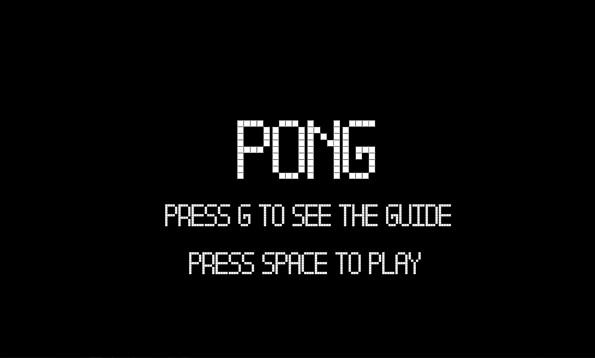
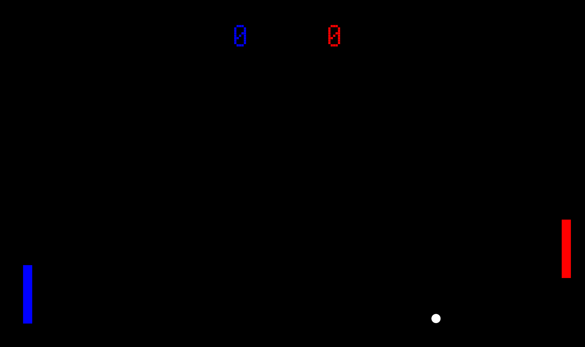
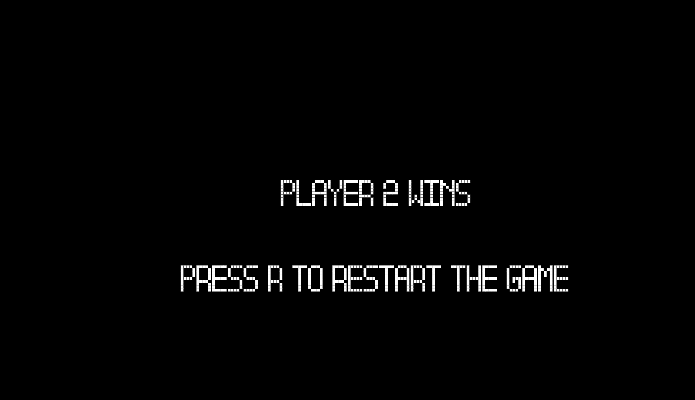

# Final Project- Pong Game

## Introduction
As a child, one of my fondest memories was to play the pong game with my brother. As I grew up, and games becomes a lot more interactive and detailed, pong is one of the few games that have still stuck around. Originally made in 1972 by Atari, this game is still available online, in arcades and a few bars. When presented this assignment, I was immediately taken back to my childhood and I decided that this is the game I want to create.
I decied to stay true to the original game and have thus used the same font and colors. While, it may lead to the game being somewhat simplistic I did not want to takeaway from the nostalgia and thus, to add a layer of complexity I made certain tweaks that change the gameplay but not how the game looks. 
In this game I used 2 potentiometers, to control two paddles on screen. The goal is to deflect the ball using your paddle and to not let it pass through. The first one to reach 5 points wins. To add some complexity and to make it more competitive, I have programmed it such that based on the score difference between the two players, the sizes of the paddles get adjusted to be able to inflict a disadvantage against the individual leading. 

## The game
### Introscreen
This screen consisted of the title and instructions for the game and also triggered the background music. 

## Gamescreen
This screen consisted of the balls, paddles and scorecounter. This was the main screen that users interacted with while playing the game.

## Endscreen 
This was the endscreen and conveyed who the winner was and how players can play the game again

## Challenges and how I solved them

#### Bounce Mechanism
This was one of the biggest challeneges from the start. When the ball was colliding with the paddle, it would deflect off of certain parts but not the others. Often it would go through the middle of the paddle. Firstly, the issue was that I did not remember that when a paddle is a drawn as a rectangle, the x and y position refer to the top left corner. Thus, when I was trying to figure our a colision, I was considering the wrong edge of the paddle. I did not realize this, until a conversation with my professor in which he pointed this out to me. Yet, the problem was not solved. Now that I had gotten that sorted, the issue was still that I was only aware of collision detection between to circles and thus, I was treating various points on the paddle as a circle and trying to detect collision between them. While, this was sort of a work around for the problem, the mechanism was still a little glitchy and I knew there had to be a better way. So I found an online resource on various types of collision detections, between squares and points or moving squares. The link is in the resources section below. Using their code, I adapted it to my game and it worked almost perfectly.

#### Effective Communication between Arduino and Processing
This was a frustrating and honestly silly mistake. After hooking on two potentiometers and sending two readings from adruino to processing, I could not figure out why processing was not able to separate the two readings and assign them to each paddle separately. For the longest time I thought there was a short circuit with my soldered potentiometers or an error in electrical connection. But I tested each potentiometer individually and they worked perfectly. Then in another conversation with the professor, I realized that while I was asking processing to separate the two values based on a comma in the middle, I had not printed a comma in arduino. Thus, processing wasn't able to separate them.

#### Soldering 
This was a very fun part of the project. I attended a soldering session just for knowledge and ended finding an application in my project. I was able to secure two big potentiometers and I needed to solder wires on them. I did not have time to solder them when I was with the professor, so I went after hours to solder by myself. It was not really a problem, just my lack of soldering experience. It made soldering time consuming as I needed some time to find my bearings. I often had to resolder to make sure that it was placed properly. Although, my solder is not the best, it does the job well. Here is an image of my soldering work:

#### Restarting Game
After the midterm, I was pretty comfortable with setting a restart feature in a game. In the past I had used various booleans that had to be turned on or off appropriately and the intro function had to be called again. I used the same approach this time and a peculiar problem occured. While the intro function did run again, upon hitting play, the user was taken directly to the end screen. I was really perplexed by this, because according to the logic of the code the intro function was only related to the end screen through the main game function. Thus, from my experience with the midterm, I thought that there were some relevant booleans that I was not turning true or false. Then, I realised that I had set the code such that at a certain score for either player, the end screen must be triggered, but I had not reset the score. So because the score was already at max, the end screen was directly getting triggered. 

#### Sound Smoothing
This was a problem that was easily resolved. The sound in the game was glitchy and broken. At first I thought the sound file was getting played multiple times and due to this overlap the sound was getting glitchy. I simply added an if command with a song.isPlaying() function and that did the trick.

## New skills learnt and acquired
#### Circuitry
Learnt how to build and play around with smart circuits
#### Soldering 
Learnt how to solder and use it in my circuits

## Diary
I kept a log of my process and daily progress. The link to which is: 
https://github.com/AnshPKachalia/IntroToIM/blob/main/Final/journal.md

circuit photo
Schematic

Overall

Resources and links

