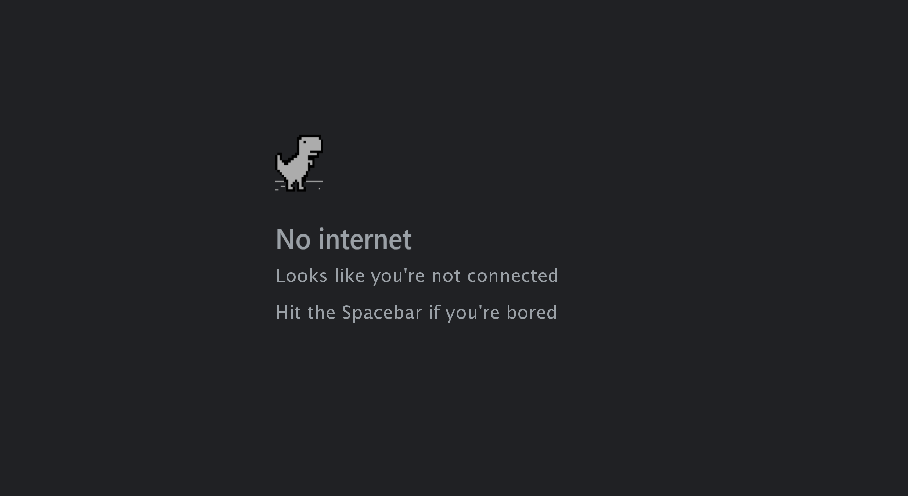

# Midterm Project: Dino Run
## Introduction
This is a game that all of us must have come across at some time when our internet connection is not working. We get too lazy to restart the connection, so we simply sit and play this. Yes! It's the dinojump game made by Sebastien Garbriel in 2014. It is an endless runner game and consists of a dinosaur running and jumping over and ducking under obsstacles. When, I started making the game, I thought it was fairly simplistic and matched my level of amateur coding. Only when I started making and runnning into multiple issues, I tried to simplify it by removing certain features to ensure that the basic structure of the game was still maintained. I kept a dairy to ensure I was planning properly and keeping track of the progress and problems I faced every coding session.
## Diary of work
(Insert pdf of diary)

## The Game
### Introscreen
The introscreen was basic and did not have too many design elemants. It was left simple to mimic the actual screen that shows up on google when the internet runs out.

### Game screen
The game screen followed a similar design as the actual game along with some extra decorations that I added such as the clouds and sun/moon. 

### End Screen
The end screen was basic and simply gave instrcutions on restarting the game. It purposely did not show the final score of the participant as I for one dislike competition in games and simply play them to relax. 

## Challenges and how they were solved:
* Dino Spritesheet not getting placed in the correct spot: Using an inclass example for motion using sketches from a sprite sheet, I tried to give motion to my running dinosaur. But in doing so, I relaized that trying to mimic the professor's code allowed me to create a short moving animation but because I did not understand the code properly, I was not able to change it to suit my needs. My dinosaur was not being displayed where i wanted it to and I could not seem to figure out how to solve it. So I decided to code it, how I understand it. I chose to take a simpler approach and just use one static image of the dinosaur.
* One of my biggest challenges through the process was understanding image arrays properly. I have made an array of cacti(Obstacles) and coded it such that it would cycle between 3 different images of cacti. But if I jumped over it successfully, it would not respawn. I just could not figure out how to solve this. I tried to change the numbers in my arrays without understanding what they did and unsurprisingly, did not acheieve the required result. Then, when casually thinking about it during lunch one day, I relaized that it could be something as simple as an if statement that tracks the x value of the moving obstacle and redraws the obstacle if it reaches a certain x value. And it worked!
* Restart issue: I made a somewhat well knit code that had various moving parts throughout the code(if statements and changing booleans). When I tried to code for resarting the game, I was unable to get it to restart even though all required functions were being called and using all logical explanations, the game should have restarted. I even asked a friend for help, who had made a game for this class a few semesters ago, and even he couldnt figure out what I was doing incorrectly. Then after hours of scrutinizing the code, I realised there was a boolean that was inherently declared true and never declared false, when trying to restart. This was a frustrating problem.
* Lastly, the most time consuming and unforeseen problem, the collision problem. Being able to respawn the obstacles, I had somehow lost the ability to detect collision, a fucntion that was working during my last coding session. This seemed strange as on face value they seem like two unrelated functions. Even if there was a collision detected, the game would not end until the cactus had hit the lft end of the screen. The professor also looked into this problem and could not figure out why this happened. In the end I decided to use a hack which did not solve the problem but hid it in a way. I decided to simply move the dinosaur to the extreme left and so when the collision occured, the obstacle would already be at the extreme left. 

## Overall
This was a fun and suprisingly challenging project. I certainly helped me understand aspects of coding I took for granted and taught me a lot about debugging.
