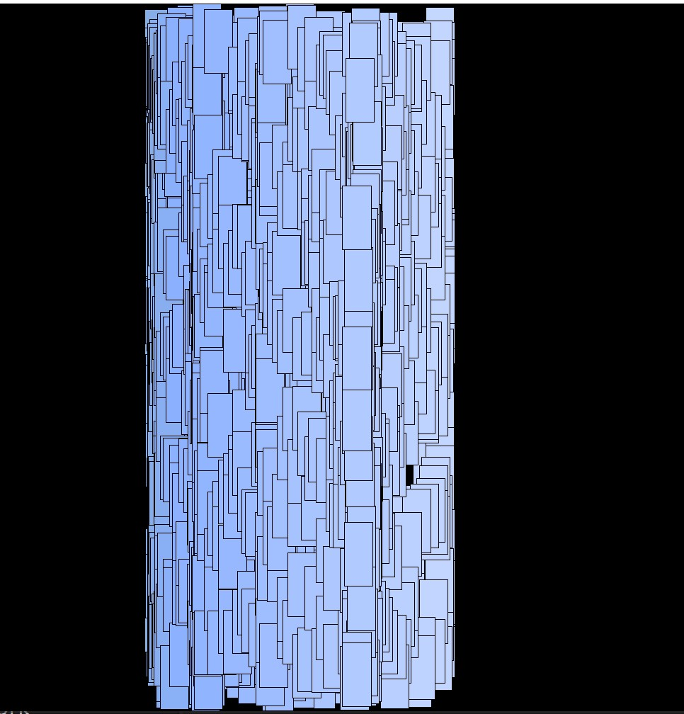

# Generative Artwork X Perlin Noise

In this piece, I tried to keep it simple and sharpen my skills of arrays and classes. I was a bit unsure of how the code flows and the logic of each step so I had to rewatch the prevous lecture and mull over the code discussed in class multiple times. As I felt a little underconfident of my skills of working with classes and arrays, I used the code shown in class and built on top of it. We were supposed to watch a video on perlin noise and I was really fascinated with the concept. So I decided I would elevate the class example my including perlin noise and using it justify the location and color of the object. This helped me understand the code used in class and also taught me the imapct of perlin noise. The good thing about the assignment was that none of the loactions or colors had to be specific, so I didnt have to worry about anything and could simply have fun exploring the code and changing parameters.

