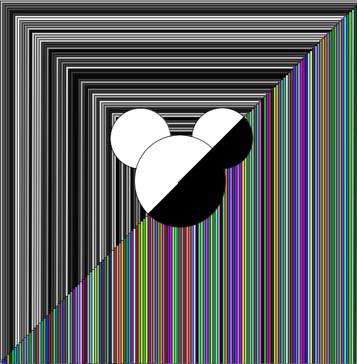

# Generative ArtWork 

## Process 
The major difficulty was to find a motivation for this project. Then I remembered of a piece of cloth I had seen while shopping that looked like multicolored TV static. I thought it would be a great image to replicate and thus I based my artwork on that. After making the static, I felt it was too colorful so I decided to split the canvas in half and make that black and white. After that I though the center looked really empty thus I decided to fill it up with my favourite childhood cartoon, Mickey. Also because Mickey mouse is really easy to sketch.  That is how I came across my final image. 

## Problems and workarounds 
The code was fairly simplistic and the beauty of it lay in the randomness of the shapes and patterns thus making the background was simply a fun experimentation process. The main difficulty I faced was while making the Mickey mouse face and trying to color a part of it with a different color. I realized that I should use two semi-circles that meet exactly on the line between the colored and discolored halves. The main issue lay in the algebra and geometry behind figuring out the points, angles and sizes of the shapes so that they could align with the diagonal. To over come this challenge, I had to resort to paper, sketch and use high-school math which I had completely forgotten.

## Anything interesting
I think the most interesting finding would be to see how shapes could be rotated because that was a feature I was not aware of and to see how the roatation angle can completely change my background.

